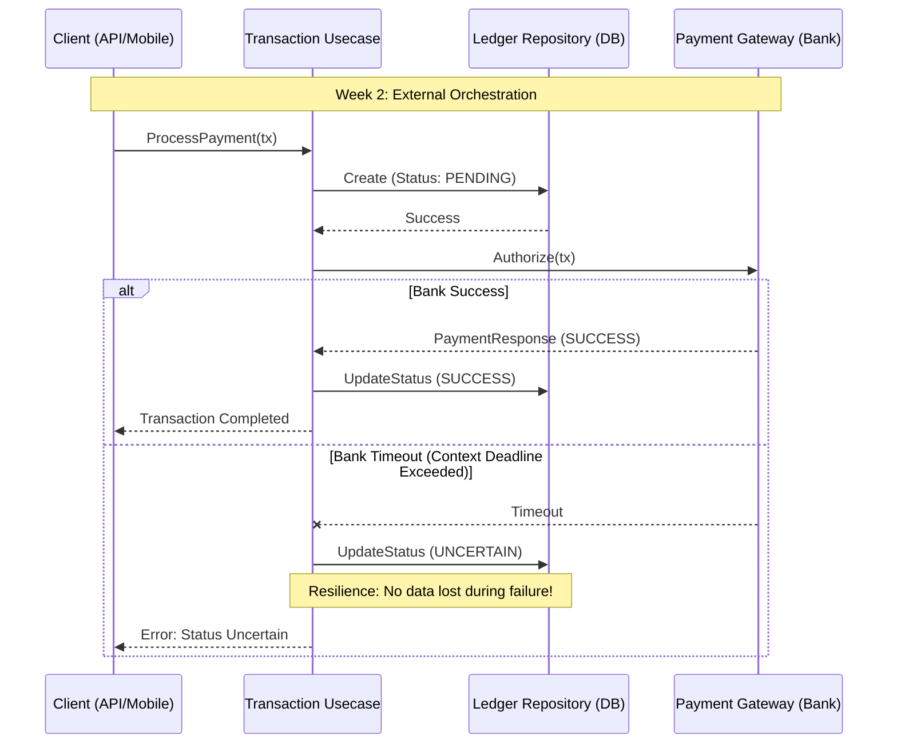

# Fintech Playground V1

A high-performance, resilient fintech ledger system built with **Go** and **PostgreSQL**. This project demonstrates industry-standard practices for handling financial transactions, focusing on data integrity, idempotency, and system resilience.

## System Architecture

The project follows **Clean Architecture** principles, separating business logic from infrastructure and external dependencies.

### Payment Flow & Resilience
The following diagram illustrates how the system handles external bank communication and manages the "Uncertain" state during network failures.

